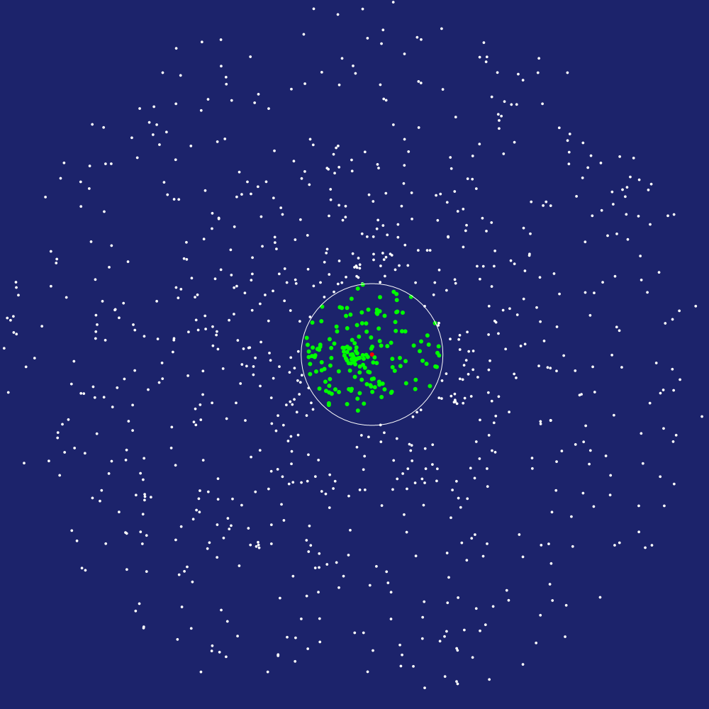
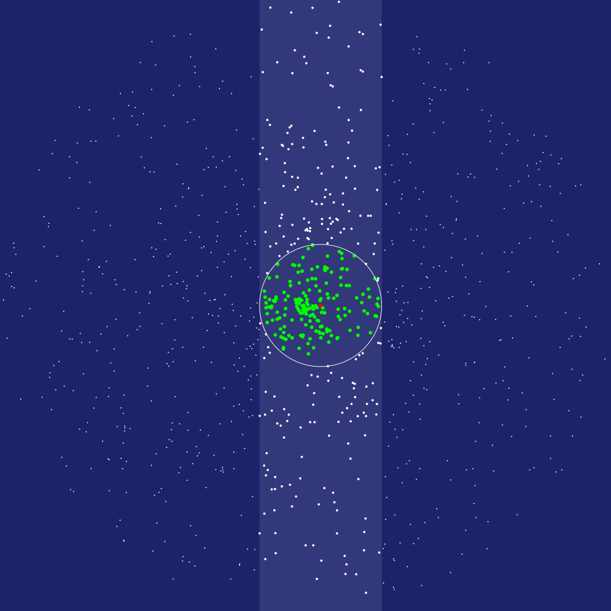
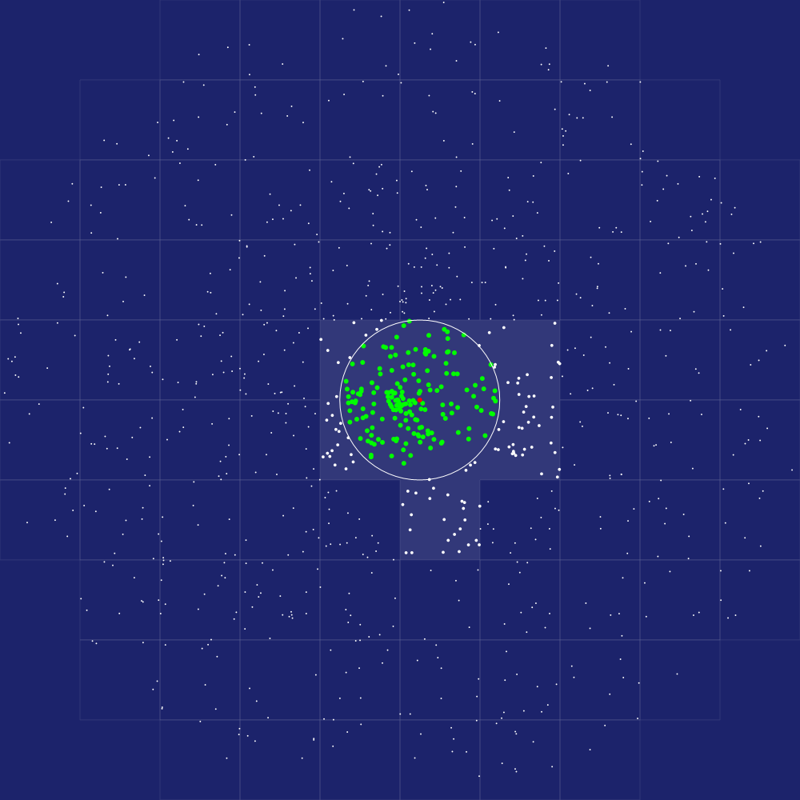
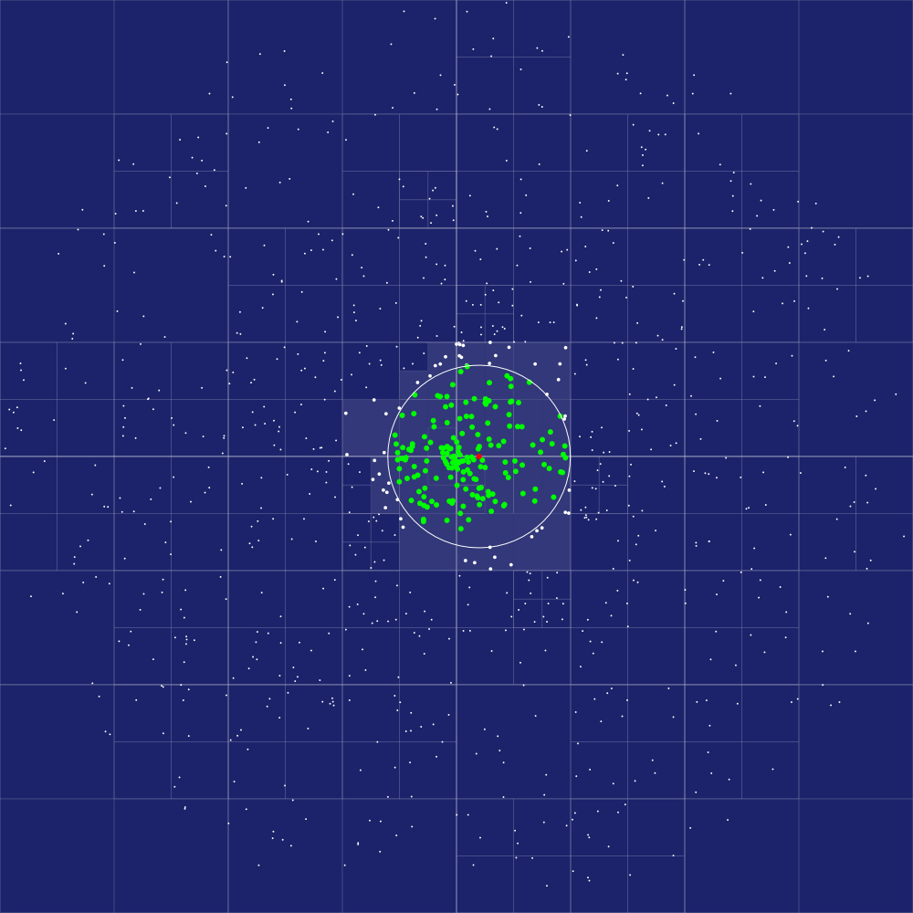
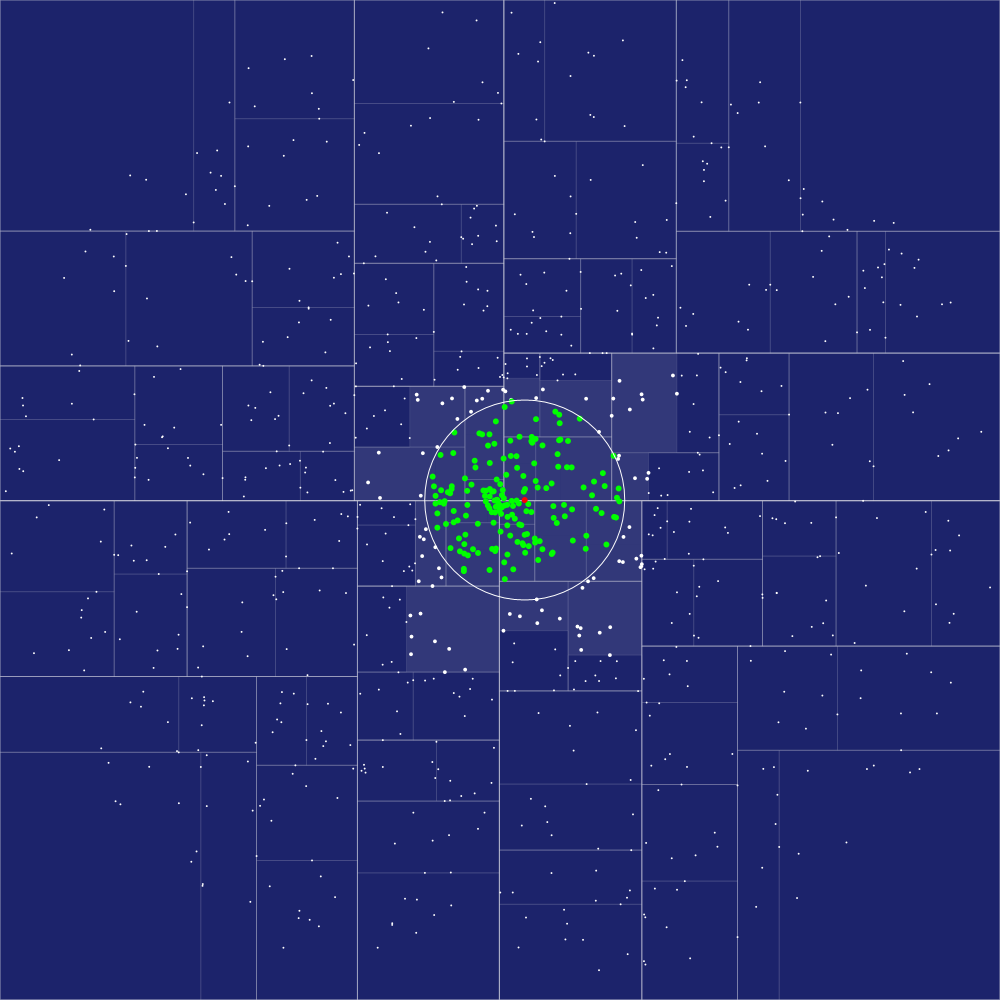

# Spatial data structures for Nim.

Spatial algorithms find "closest" things faster than simple brute force iteration would. They make your code run faster using smarter data structures. This library has different "Spaces" that you can use to speed up games and graphical applications.

One key design decision is that all spaces have a very similar API and can be easily swapped. This way you can swap out spaces and see which one works best for your use case.

### Perf time (1000 vs 1000 at 0.01 distance):
```
BruteSpace ......................... 1.834 ms      1.896 ms    ±0.076   x100
SortSpace .......................... 1.530 ms      1.544 ms    ±0.018   x100
HashSpace .......................... 0.477 ms      0.487 ms    ±0.012   x100
QuadSpace .......................... 0.210 ms      0.219 ms    ±0.009   x100
KdSpace ............................ 0.795 ms      0.805 ms    ±0.012   x100
```

You would usually pick the best one for your usecase by profiling and tuning. There is a cost to generating each space, you need to make sure it justifies the lookup time savings.

# BruteSpace

BruteSpace is basically a brute force algorithm that takes every inserted element and compares to every other inserted element.



The BruteSpace is faster is when there are like less elements in the space or you don't do many look ups. It’s a good baseline space that enables you to see how slow things actually can be. Don't discount it! Linear scans are pretty fast when you are just zipping through memory. Brute force might be all you need!

# SortSpace

SortSpace is probably the simplest spatial algorithm you can have. All it does is sorts all entries on one axis. Here it does the X axis. Then all it does is looks to the right and the left for matches. It’s very simple to code and produces good results when the radius is really small.



You can see we are checking way less elements compared to BruteSpace. Instead of checking vs all elements we are only checking in the vertical slice.

SortSpace draws its power from the underlying sorting algorithm n×log(n) nature. It’s really good for very small distances when you don’t expect many elements to appear in the vertical slice. SortSpace is really good at cache locality because you are searching things next to each other and are walking linearly in memory.

# HashSpace

HashSpace is a little more complex than SortSpace but it’s still pretty simple. Instead of drawing the power from a sorting algorithm it draws its power from hashtables. HashSpace has a resolution and every entry going in is put into a grid-bucket. To check for surrounding entries you simply look up closest grid buckets and then loop through their entries.



HashSpaces are really good for when your entries are uniformly distributed with even density and things can’t really bunch up too much. They work even better when entries are really far apart. They are also really good when you are always searching the same distance in that you can make the grid size match your search radius. You can tune this space for your usecase.

# QuadSpace

QuadSpace is basically the same as "quad tree" (I just like the space theme). Quad trees are a little harder to make but usually winners in all kinds of spatial applications. They work by starting out with a single quad and as more elements are inserted into the quad they hit maximum elements in a quad and split into 4. The elements are redistributed. As those inner quads begin to fill up they are split as well. When looking up stuff you just have to walk into the closets quads.



QuadSpaces are really good at almost everything. But they might miss out in some niche cases where SortSpaces (really small distances) or HashSpaces (uniform density) might win out. They are also bad at cache locality as many pointers or references might make you jump all over the place.

# KdSpace

Just like QuadSpace is about Quad Trees, KdSpace is about kd-tree. Kd-Trees different from quad trees in that they are binary and they sort their results as they divide. Potentially getting less nodes and less bounds to check. Quad trees build their nodes as new elements are inserted while kd-trees build all the nodes in one big final step.



KdSpace trees take a long time to build. In theory KdSpace would be good when the entries are static, the tree is built once and used often. While QuadSpace might be better when the tree is rebuilt all the time.

# Always be profiling.

You can’t really say one Space is faster than the other you always need to check. The hardware or your particular problem might drastically change the speed characteristics. This is why all spaces have a similar API and you can just swap them out when another space seems better for your use case.
